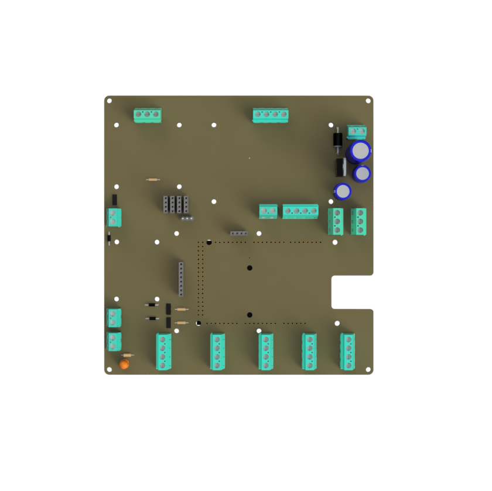

# 📡 Arduino Mega

:::tip
File link: https://github.com/GreenCrateSG/pcb
:::



## Overview

## Printed Circuit Board Design


_design by Ajay Shanker_

1. **LED Light (Power indicator)** - Safety feature to indicate that the PCB is powered on.
2. **Linear Voltage Regulator** - 12V DC power supply from a switching power is converted to 5V DC. The 5V DC is then used to power the Arduino Mega and the 12V DC is used to power the Fan.
3. **Perisatic Pump** - The pump is used to pump the nutrient solution from the reservoir to the grow bed.
4. **5V Fan Controller** - The fan is used to cool the internal junction box.
5. **12V Fan Controller** - The fans are used to have controlled environment for the plants.
6. **Arduino Mega** - The Arduino Mega is the main microcontroller that controls the entire system.
7. **4 Channel Relay** - The relay is used to control the 12V Grow Lights.
8. **DHT11 Temperature & Humdidty** - The sensor is used to measure the temperature and humidity of the environment. (One Wire Protocol)
9. **TSL2591 Lux Sensor** - The sensor is used to measure the light intensity of the environment. (I2C Protocol)
10. **Atlas Scientific Sensor** - The sensor is used to measure the pH, EC and temperature of the reservoir. (I2C Protocol)
11. **DFRduino Ethernet W5100S** - The ethernet shield is used to connect to MQTT Broker. (SPI Protocol)


## Code Design

:::tip
File link: https://github.com/GreenCrateSG/iot
:::

### MQTT API

Broken down to 3 main topics:

**cmnd**: command mode *(e.g. on grow lights)*

**stat**: status mode *(e.g. check if the altas scientific sensor is working)*

**tele**: telemetry mode *(e.g. what is the current temperature of the environment)*

```cpp
/** Topic **/

#define TOPIC_API             "arduino/#"  // <- any topic related to arduino
#define TOPIC_CMND            "cmnd"      // command
#define TOPIC_STAT            "stat"      // status
#define TOPIC_TELE            "tele"      // telemetry

#define DHTTOP_TEMP_TOPIC     "sensor/dhttop/temperature"
#define DHTTOP_HUM_TOPIC      "sensor/dhttop/humidity"
#define DHTBOT_TEMP_TOPIC     "sensor/dhtbot/temperature"
#define DHTBOT_HUM_TOPIC      "sensor/dhtbot/humidity"

#define LUXTOP_TOPIC          "sensor/luxtop"
#define LUXBOT_TOPIC          "sensor/luxbot"

#define PH_TOPIC              "sensor/ph"
#define EC_TOPIC              "sensor/ec"
#define TEMP_TOPIC            "sensor/temp"

#define POWER_TOPIC           "sensor/power"
#define LOADVOLTAGE_TOPIC     "sensor/loadvoltage"
#define CURRENT_TOPIC         "sensor/current"

#define PH_TARGET_TOPIC       "set/ph_target"
#define EC_TARGET_TOPIC       "set/ec_target"
#define PH_SET_UPPER          "set/ph_upper"
#define PH_SET_LOWER          "set/ph_lower"
#define EC_SET_THRESHOLD      "set/ec_threshold"

#define PUMP_SET_TOPIC        "set/pump"
#define LIGHT_ONE_SET_TOPIC   "set/light_one"
#define LIGHT_TWO_SET_TOPIC   "set/light_two"

#define MOTOR_A_SET_TOPIC     "set/motor_a"
#define MOTOR_B_SET_TOPIC     "set/motor_b"

#define AUTO_NUTRITION_DOSE  "auto_nutrition_dose"
/****/
```

#### MQTT Callback

```cpp

String _str;

/**
 * @brief Callback for command
 * @param subtopic Subtopic
 * @param hydro Class Hydro
 */
void command_callback(String& subtopic, String& payload, Hydro& hydro) {
  D_println("[MQTT]: command");

  _str  = String();  // clear string
  _str += subtopic;
  _str += "/";
  _str += TOPIC_CMND;

  if (subtopic == PH_TARGET_TOPIC)
    hydro.set_ph_target(payload.toFloat());
  else if (subtopic == EC_TARGET_TOPIC)
    hydro.set_ec_target(payload.toFloat());
  else if (subtopic == PH_SET_UPPER)
    hydro.set_ph_upper_threshold(payload.toFloat());
  else if (subtopic == PH_SET_LOWER)
    hydro.set_ph_lower_threshold(payload.toFloat());
  else if (subtopic == EC_SET_THRESHOLD)
    hydro.set_ec_threshold(payload.toFloat());
  else if (subtopic == PUMP_SET_TOPIC) {
    if (payload == "true")
      hydro.set_pump(true);
    else
      hydro.set_pump(false);
  } else if (subtopic == LIGHT_ONE_SET_TOPIC) {
    if (payload == "true")
      hydro.set_light_one(true);
    else
      hydro.set_light_one(false);
  } else if (subtopic == LIGHT_TWO_SET_TOPIC) {
    if (payload == "true")
      hydro.set_light_two(true);
    else
      hydro.set_light_two(false);
  } else if (subtopic == MOTOR_A_SET_TOPIC) {
    if (payload == "true")
      hydro.set_solution_a_motor(true);
    else
      hydro.set_solution_a_motor(false);
  } else if (subtopic == MOTOR_B_SET_TOPIC) {
    if (payload == "true")
      hydro.set_solution_b_motor(true);
    else
      hydro.set_solution_b_motor(false);
  } else
    mqtt_publish(_str.c_str(), "Error");
}

/**
 * @brief Callback for telemetry
 * @param subtopic Subtopic
 * @param hydro Class Hydro
 */
void telemetry_callback(String& subtopic, String& payload, Hydro& hydro) {
  D_println("[MQTT]: telemetry");

  _str  = String();  // clear string
  _str += subtopic;
  _str += "/";
  _str += TOPIC_TELE;

  if (subtopic == DHTTOP_TEMP_TOPIC)
    mqtt_publish(_str.c_str(), String(hydro.top_sensors.get_temp()).c_str());
  else if (subtopic == DHTTOP_HUM_TOPIC)
    mqtt_publish(_str.c_str(), String(hydro.top_sensors.get_hum()).c_str());
  else if (subtopic == DHTBOT_TEMP_TOPIC)
    mqtt_publish(_str.c_str(), String(hydro.bottom_sensors.get_temp()).c_str());
  else if (subtopic == DHTBOT_HUM_TOPIC)
    mqtt_publish(_str.c_str(), String(hydro.bottom_sensors.get_hum()).c_str());
  else if (subtopic == LUXTOP_TOPIC)
    mqtt_publish(_str.c_str(), String(hydro.top_sensors.get_lux()).c_str());
  else if (subtopic == LUXBOT_TOPIC)
    mqtt_publish(_str.c_str(), String(hydro.bottom_sensors.get_lux()).c_str());
  else if (subtopic == PH_TOPIC)
    mqtt_publish(_str.c_str(), String(hydro.reservoir.get_ph()).c_str());
  else if (subtopic == EC_TOPIC)
    mqtt_publish(_str.c_str(), String(hydro.reservoir.get_ec()).c_str());
  else if (subtopic == TEMP_TOPIC)
    mqtt_publish(_str.c_str(), String(hydro.reservoir.get_temp()).c_str());
  else
    mqtt_publish(_str.c_str(), "Error");
}

/**
 * @brief Callback for status
 * @param subtopic Subtopic
 * @param hydro Class Hydro
 */
void status_callback(String& subtopic, String& payload, Hydro& hydro) {
  D_println("[MQTT]: status");

  _str  = String();  // clear string
  _str += subtopic;
  _str += "/";
  _str += TOPIC_STAT;

  if (subtopic == AUTO_NUTRITION_DOSE)
    if (hydro.reservoir.get_ec() < hydro.get_ec_threshold())
      mqtt_publish(_str.c_str(), "true");
    else
      mqtt_publish(_str.c_str(), "false");
  else
    mqtt_publish(subtopic.c_str(), "OK");
}
```

### Sensors Class

```cpp
/**
 * @brief Class Set of Sensor
 *
 */
class Sensors {
 private:
  float temp = 0.0;
  float hum = 0.0;
  int lux = 0;

 public:
  // init
  Sensors() {
    set_temp(0.0);
    set_hum(0.0);
    set_lux(0);
  }

  Sensors(float _temp, float _hum, int _lux) {
    set_temp(_temp);
    set_hum(_hum);
    set_lux(_lux);
  }

  ~Sensors() {}

  float get_temp() { return temp; };
  float get_hum() { return hum; };
  uint16_t get_lux() { return lux; }
  State set_temp(float _val);
  State set_hum(float _val);
  State set_temp_hum(float _temp, float _hum);
  State set_lux(int _lux);
  State serial_print();
};
```

### Reservoir Class

```cpp
/**
 * @brief Class Set of Reservoir
 *
 */
class Reservoir {
 private:
  float temp = 0.0;
  float ph = 0.0;
  float ec = 0.0;

 public:
  // init
  Reservoir() {
    set_temp(0.0);
    set_ph(0.0);
    set_ec(0.0);
  }
  Reservoir(float _temp, float _ph, float _ec) {
    set_temp(_temp);
    set_ph(_ph);
    set_ec(_ec);
  }

  ~Reservoir() {}

  float get_temp() { return temp; }
  float get_ph() { return ph; }
  float get_ec() { return ec; }
  State set_temp(float _temp);
  State set_ph(float _ph);
  State set_ec(float _ec);
  State set_all(float _temp, float _ph, float _ec);
  State serial_print();
};

```

### Junction Box Class

```cpp
// Main Class
class Hydro {
 private:
  // Dosing thresholds
  float ph_upper_threshold = 6.5;  // Upper pH threshold for pH adjustment
  float ph_lower_threshold = 6.0;  // Lower pH threshold for pH adjustment
  float ec_threshold = 2.0;        // EC threshold for nutrient dosing

  // Target values
  float ec_target = 2.4;  // Target EC value
  float ph_target = 6.2;  // Target pH value

  float reservoir_volume = 135000 * 0.5;  // volume of reservoir (ml)
  float flowrate_perastatic_pump = 45;    // ml/min
  float nutrition_concentration = 200;    // 5ml per 1000ml
  float amount_of_nutrition_needed = reservoir_volume / nutrition_concentration;

 public:
  Hydro() {}
  Hydro(float _ph_upper_threshold, float _ph_lower_threshold, float _ec_threshold, float _ec_target, float _ph_target) {
    set_ph_upper_threshold(_ph_upper_threshold);
    set_ph_lower_threshold(_ph_lower_threshold);
    set_ec_threshold(_ec_threshold);
    set_ec_target(_ec_target);
    set_ph_target(_ph_target);
  }

  ~Hydro() {}
  // bool light_one = false;  // Germination
  // bool light_two = false;  // Germination

  Sensors top_sensors = Sensors();
  Sensors bottom_sensors = Sensors();

  Reservoir reservoir = Reservoir();

  State auto_nutrition_dose();  // todo

  // Getters
  float get_ph_upper_threshold() { return ph_upper_threshold; }
  float get_ph_lower_threshold() { return ph_lower_threshold; }
  float get_ec_threshold() { return ec_threshold; }
  float get_ec_target() { return ec_target; }
  float get_ph_target() { return ph_target; }

  // Setters
  State set_ph_upper_threshold(float _val);
  State set_ph_lower_threshold(float _val);
  State set_ec_threshold(float _val);
  State set_ec_target(float _val);
  State set_ph_target(float _val);
  void set_pump(bool _val);
  void set_light_one(bool _val);
  void set_light_two(bool _val);
  void set_solution_a_motor(bool _val);
  void set_solution_b_motor(bool _val);
  State print();
};
```
