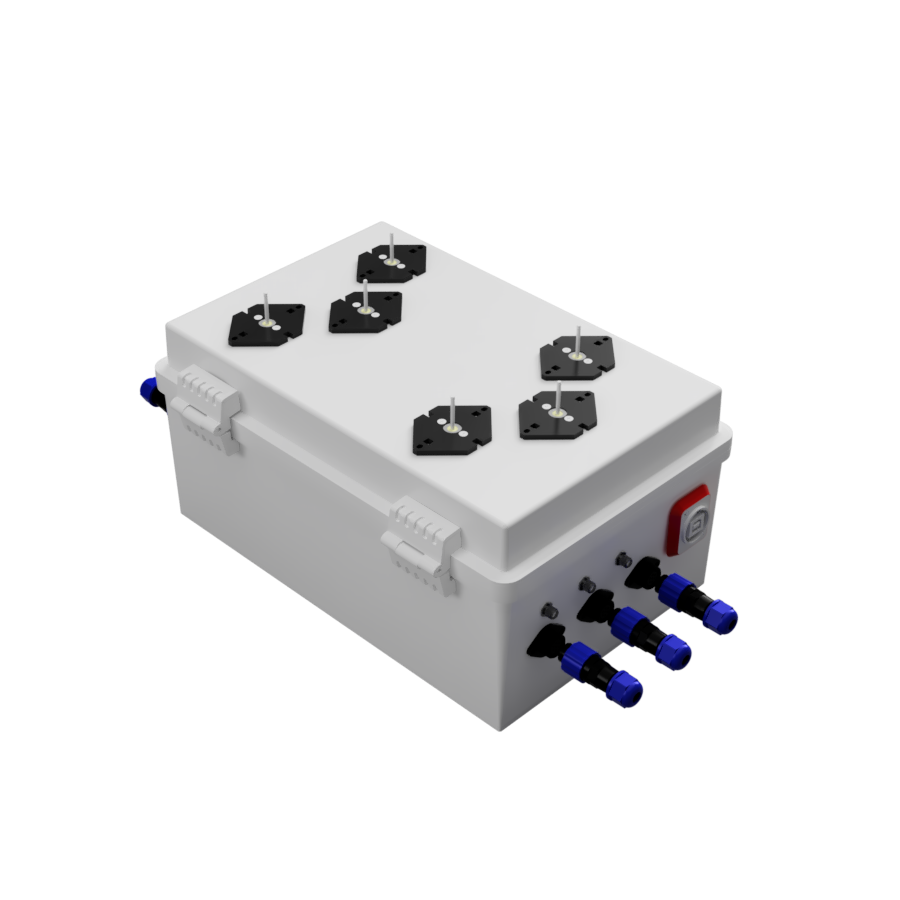
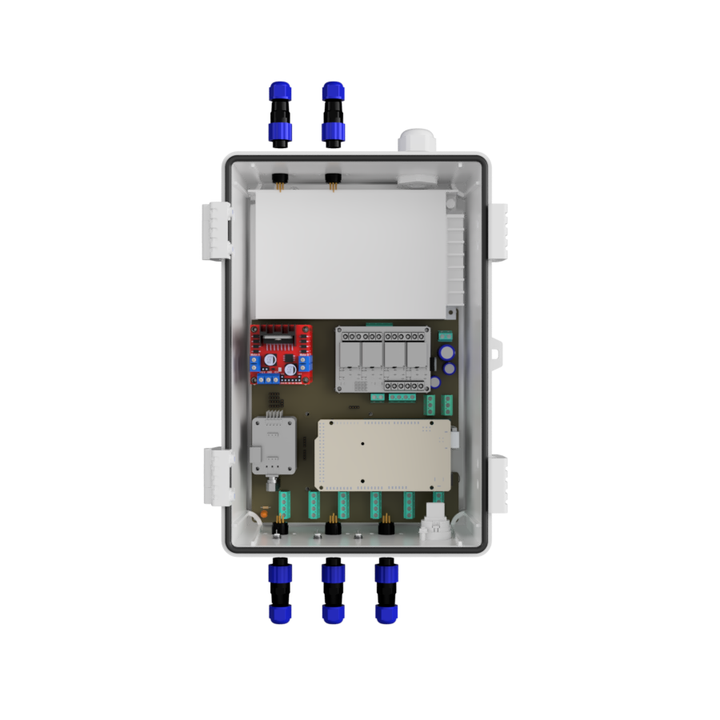

import imgJunctionBox from './img/IMG_2679.jpeg';

# 🔌 Junction Box Design

## Upper part of the Junction Box

1. **DHT11** - The sensor is used to measure the temperature and humidity of the environment. (One Wire Protocol)
2. **TSL2591** - The sensor is used to measure the light intensity of the environment. (I2C Protocol)
3. **Main AC** - The main AC is used to power the entire system.

## Lower part of the Junction Box

1. **Atlas Scientific Sensor** - The sensor is used to measure the pH, EC and temperature of the reservoir. (I2C Protocol)
2. **DHT11** - The sensor is used to measure the temperature and humidity of the environment. (One Wire Protocol)
3. **TSL2591** - The sensor is used to measure the light intensity of the environment. (I2C Protocol)
4. **USB Port** - The USB port is used to connect to the Arduino Mega.

## Internal part of the Junction Box

1. **Switching Limit Power Supply** - The power supply is used to convert the 230V AC to 5 & 12V DC.
2. **Sonoff POWR2** - The Sonoff POWR2 is used to monitor power consumption.
3. **3 x L298N drivers** - The L298N drivers are used to control the 6 peristaltic pumps.
4. **4 Channel Relay Contoller** - The relay is used to control the 12V Grow Lights.
5. **Altas Scientific Analog to digital** - The sensor is used to measure the pH, EC and temperature of the reservoir. (I2C Protocol)
6. **Arduino Mega & DFRduino Ethernet W5100S** - The Arduino Mega is the main microcontroller that controls the entire system. The ethernet shield is used to connect to MQTT Broker. (SPI Protocol)
7. **SIM Card Router** - The router is used to connect to the internet.
