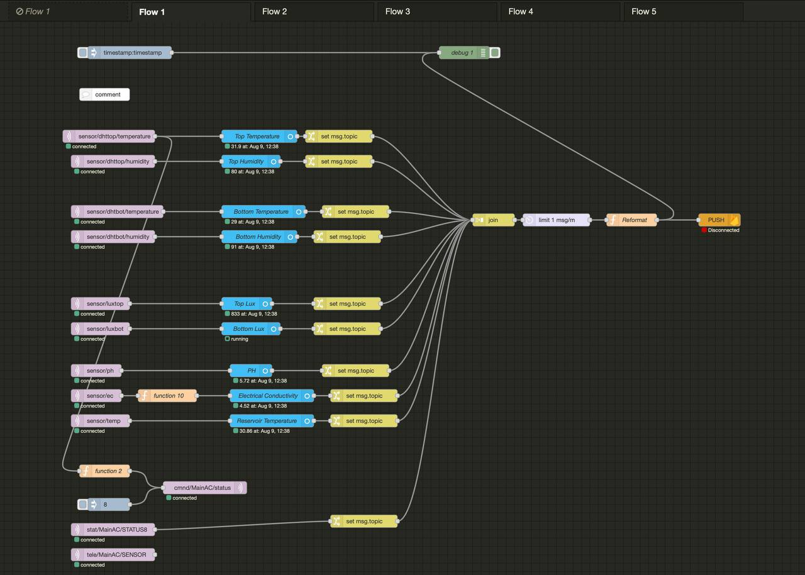
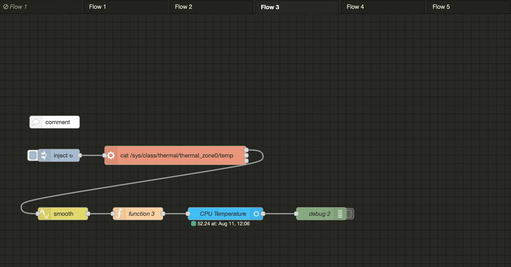
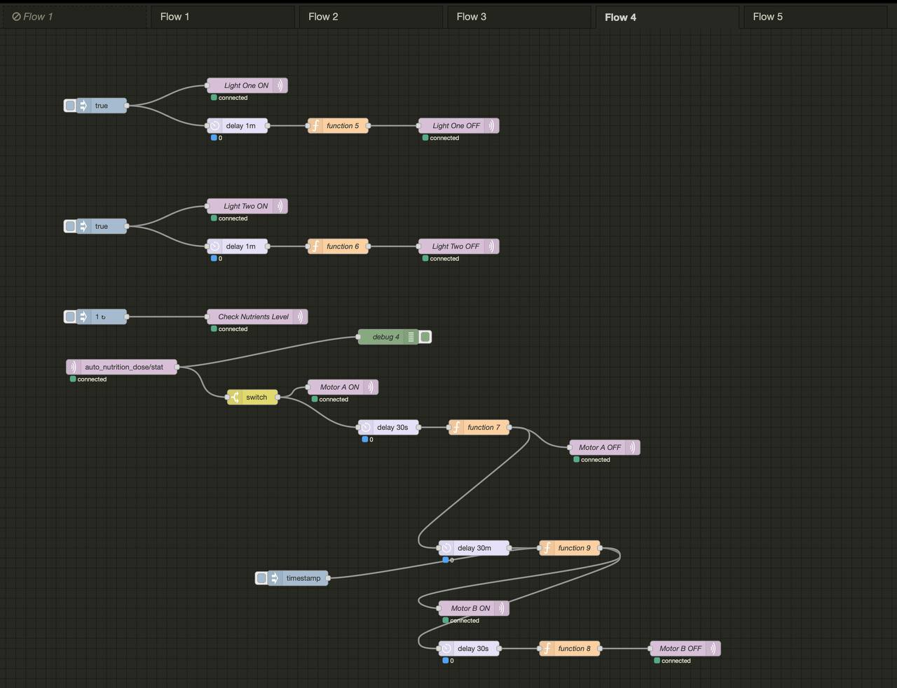
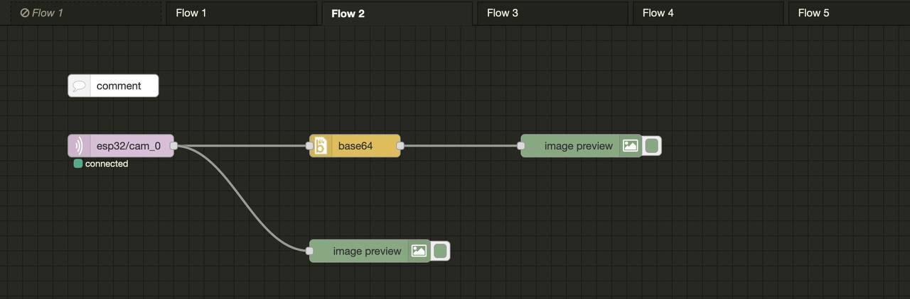

# 🧠 Raspberry Pi running Docker

:::tip

Home Assistant is used to control the entire system as it is easier to manage to the docker containers and able to restore the system easily.
link: https://github.com/GreenCrateSG/software

:::

## Mosquitto

*MTQQ broker for the entire local network.*

## Node-RED

*Node-RED is used to automate the entire system.*

### MQTT subscription and publishing

Subscribing to the MQTT topics published by arduino mega sensor. Set interval to push data to `Firebase` and `InfluxDB`.

### Raspberry Pi Temperature

Getting the temperature from the Raspberry Pi to adjust the internal fan speed accordingly.

### Automation

Simple check the ec and ph value to add the solution a & b accordingly.

### Image Capture

:::danger
Not stable for release yet.

Link: https://github.com/GreenCrateSG/GreenCrateSG_Cam_MQTT
:::

Sending image over MQTT using `base64` encoding.

## InfluxDB

*InfluxDB is used to store the data from the sensors.*

## Grafana

*Grafana is used to visualize the data from the sensors imported from InfluxDB Database.*

## Portainer

*Portainer is used to manage the docker containers.*
